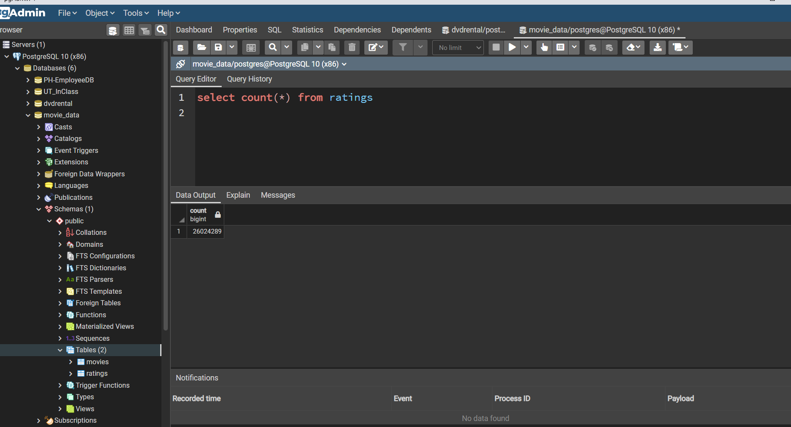

# Movies-ETL
## Purpose
This analysis is to extract data from wiki and kaggle movies data, tranfrom data into readable format and load data into postgreSQL database.

## Result

Generate two tables in postgreSQL one is movies, the other is ratings

